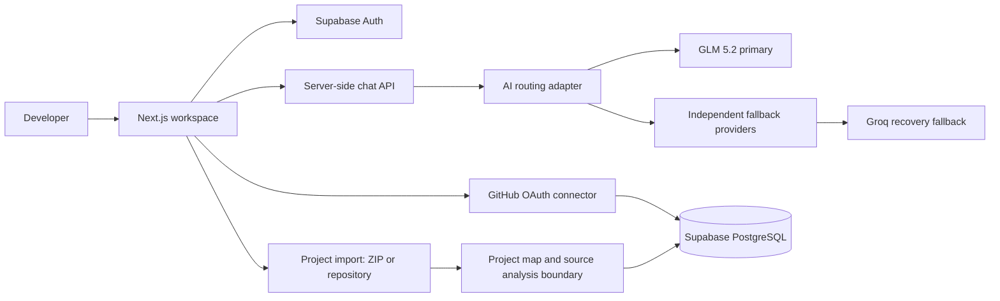

<p align="center">
  
</p>

<p align="center">
  <a href="https://dev-desk-ai-phi.vercel.app"></a>
  <a href="https://github.com/Muneeza2071/DevDesk-AI-"></a>
  <a href="https://vercel.com"></a>
</p>

<p align="center">
  
</p>

<p align="center">
  <a href="https://nextjs.org"></a>
  <a href="https://www.typescriptlang.org"></a>
  <a href="https://tailwindcss.com"></a>
  <a href="https://supabase.com"></a>
  <a href="https://github.com"></a>
  <a href="https://vercel.com"></a>
</p>

<p align="center">
  <strong>A production-style developer workspace for understanding codebases, investigating issues, and planning safer changes.</strong>
</p>

---

## Overview

**DevDesk AI** is a full-stack developer workspace created by **Abbas Hussain**. Developers can sign in, connect a GitHub repository, import a ZIP or project files, ask questions about their codebase, and receive structured explanations, debugging guidance, and previewable code suggestions.

The product combines a carbon-black glassmorphism interface with a privacy-conscious server boundary. General chat is routed through server-side AI adapters, while source-backed analysis follows tighter privacy limits so imported project content is not sent to unrelated fallbacks.

| Area | What DevDesk AI provides |
| --- | --- |
| **Developer chat** | General engineering guidance, debugging help, architecture explanations, and code-oriented answers. |
| **Project intelligence** | ZIP and GitHub repository import flows, project mapping, source-backed analysis, and questions that clarify project context. |
| **GitHub workflow** | OAuth repository connection, repository selection, and review-gated write-back rather than silent commits. |
| **Workspace UX** | Persistent chat history, project hub, analysis workspace, code blocks with copy/preview actions, and mobile-aware navigation. |
| **Voice and media** | Voice-call workspace, prompt dictation entry points, and controlled media tools. |

---

## Product highlights

<p>
  
  
  
  
</p>

| Capability | Implementation detail |
| --- | --- |
| **Secure multi-provider recovery** | GLM 5.2 remains the primary general-chat model. Server-side fallbacks are bounded, logged without prompts or keys, and include a verified Groq recovery path. |
| **Protected source analysis** | Imported source analysis uses stricter routing boundaries and avoids broad independent-provider or anonymous fallback paths. |
| **Account-scoped workspace** | Conversations, selected repositories, and imported-project state are scoped to the signed-in account instead of leaking across users. |
| **Responsive product design** | Carbon black glass panels, cyan-violet accents, and mobile-first breakpoints tuned for narrow Android screens. |
| **Actionable code output** | Copyable syntax-highlighted code blocks and sandboxed preview support for applicable HTML/CSS output. |

---

## Architecture



> **Security boundary:** Provider credentials, GitHub OAuth secrets, token-encryption material, and Supabase service credentials remain on the server. They are never bundled into the browser client or committed to source control.

---

## Technology stack

| Layer | Technology |
| --- | --- |
| **Frontend** | Next.js App Router, React 19, TypeScript, Tailwind CSS 4, Lucide icons |
| **Backend** | Next.js route handlers with an Express development service and validated server modules |
| **Database and auth** | Supabase PostgreSQL with cookie-based SSR authentication |
| **AI integration** | Server-side provider adapter with GLM 5.2 primary routing and controlled recovery fallbacks |
| **Integrations** | GitHub OAuth connector, ZIP/project import, repository browser, voice workspace |
| **Deployment** | Vercel with sensitive Production and Preview environment variables |
| **Testing** | TypeScript checks, production build validation, and deterministic application/server regression tests |

---

## Getting started

### Prerequisites

Install **Node.js 20+** and **pnpm 11+**. You will also need a Supabase project and a GitHub OAuth App if you want to exercise authentication and repository connection locally.

### Install and run

```bash
git clone https://github.com/Muneeza2071/DevDesk-AI-.git
cd DevDesk-AI-
pnpm install
pnpm dev
```

Open the local Next.js URL shown in the terminal. The development command runs the web application and the companion server process together.

### Validate before deployment

```bash
pnpm test
pnpm check
NODE_ENV=production pnpm build
```

---

## Environment configuration

Create your deployment environment values in **Vercel** or a local server-only environment file. Never place a real secret in a `NEXT_PUBLIC_*` variable, browser storage, or Git history.

| Variable group | Purpose |
| --- | --- |
| **Supabase** | Public URL and publishable key for the browser, plus server-only service credentials for privileged operations. |
| **Application** | `APP_URL` and the deployment callback URLs required by auth flows. |
| **GitHub connector** | Client ID, client secret, and encryption key used to protect stored connector tokens. |
| **AI providers** | Server-only OpenRouter, xAI, Cerebras, or Groq credentials. Providers are optional fallbacks; they must never be exposed to the browser. |

For GitHub OAuth, configure the DevDesk connector callback as:

```text
https://your-domain.example/api/github/callback
```

Supabase GitHub sign-in and the DevDesk repository connector are intentionally separate OAuth flows: one authenticates the user, while the other grants repository access.

---

## Security model

| Principle | How it is applied |
| --- | --- |
| **Server-only secrets** | API keys and privileged credentials are read in server code, never from the public client bundle. |
| **Encrypted connector tokens** | GitHub access tokens are protected before storage and are not returned to the browser. |
| **Safe project ingestion** | Uploaded archives are treated as untrusted input and inspected with path/size safety controls. |
| **Source privacy** | Source-backed analysis has a restricted AI routing policy separate from ordinary general chat. |
| **Human approval for writes** | GitHub code changes are staged for review; DevDesk does not silently commit user repository changes. |
| **Failure observability** | Provider failure diagnostics record safe statuses without logging prompts, source code, or credentials. |

---

## Quality verification

The project includes deterministic regression coverage for routing order, outage recovery, source-privacy boundaries, file-import safety, GitHub review gating, and chat behavior. The current production audit also verified ten sequential prompts in one live conversation with preserved prior turns and no capacity-guidance response on the working Groq recovery path.

External AI services can still experience quota limits, authorization changes, or outages. DevDesk is therefore designed for **best-effort resilient routing**, not an unrealistic guarantee that every third-party provider will always be available.

---

## Repository map

```text
app/                     Next.js App Router screens and API routes
app/components/          Workspace, auth, project, and chat UI components
server/                  AI routing, provider adapters, validation, and tests
supabase/schema.sql      PostgreSQL schema and auth profile trigger
public/brand/            DevDesk visual assets and favicon source
todo.md                  Product audit and implementation checklist
```

---

## Live links

<p>
  <a href="https://dev-desk-ai-phi.vercel.app"></a>
  <a href="https://github.com/Muneeza2071/DevDesk-AI-"></a>
</p>

---

<p align="center">
  Built by <strong>Abbas Hussain</strong> as a portfolio project for modern full-stack engineering, AI integration, secure developer tooling, and product-focused UI design.
</p>

<p align="center">
  <sub>DevDesk AI is a developer tool. It does not automatically modify user repositories without review and approval.</sub>
</p>
